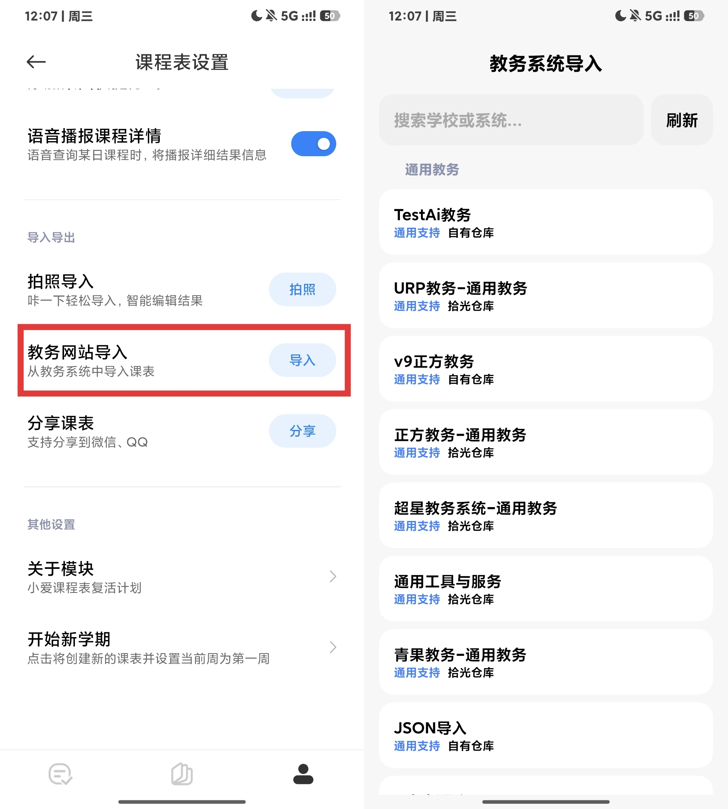

# 课表修复-R

恢复超级小爱内置课表的导入功能，可选择AI解析/适配仓库/其他课表软件等导入至小爱课程表  

## 作用域
超级小爱(com.miui.voiceassist)

## 下载

RELEASE  

## 使用
**启用模块后正常点击导入-选择适配器进行导入**

## 反馈与适配申请

QQ群:[1090259252](https://qm.qq.com/q/I31mBbA1mU)

### 支持我的开发  

你可以通过下方赞赏码支持我的开发，或通过我的aff注册[Agent Router公益站](https://agentrouter.org/register?aff=HRHy)，你可以获得175刀的token，我也能获得相应token以维持开发  

